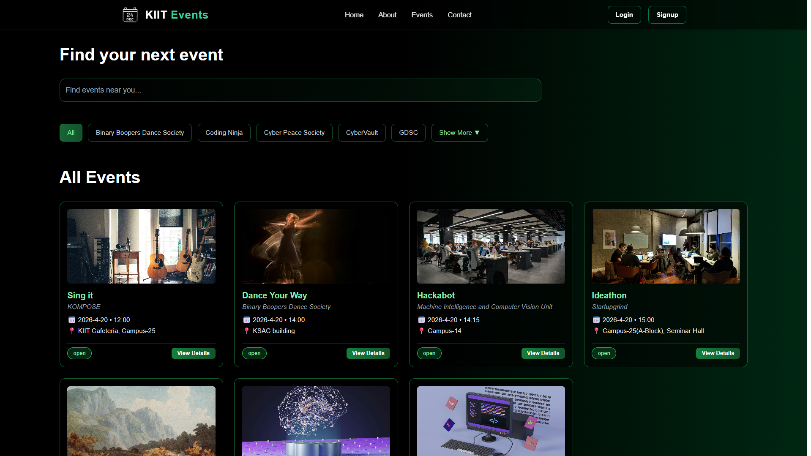
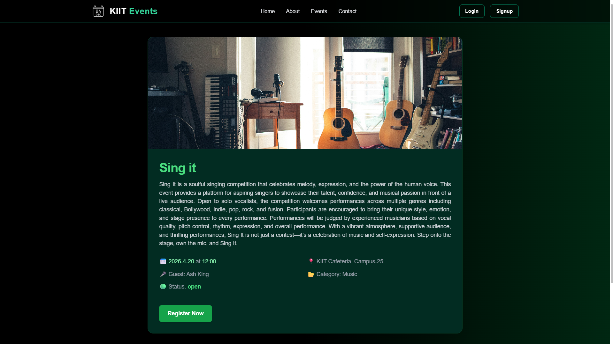
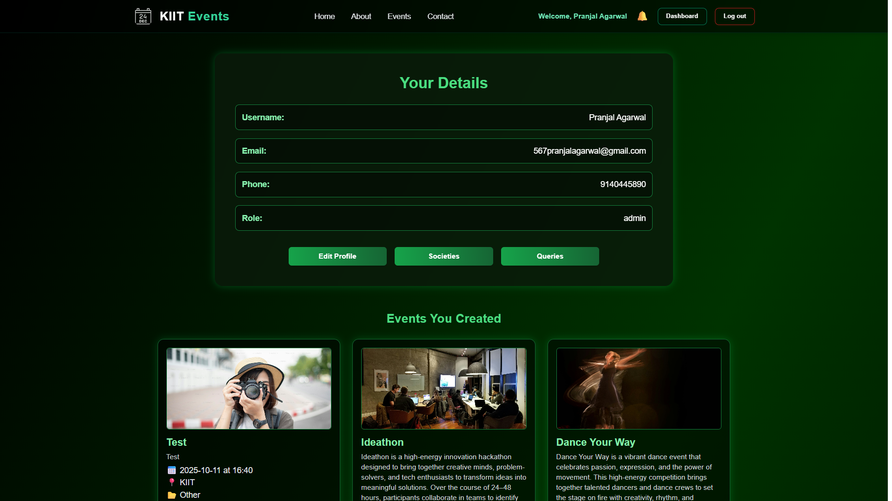
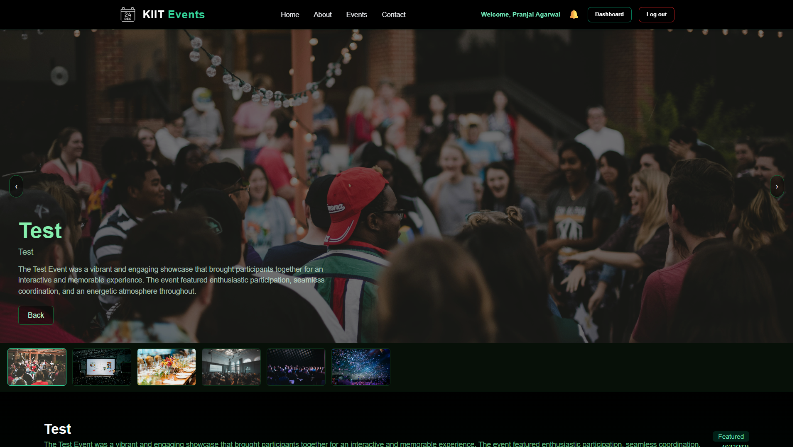

# KIIT Events

A full-stack event discovery and management platform built for university students and societies.

## Live Demo

[View Live](YOUR_DEPLOYMENT_LINK)

## Screenshots









## Features

- Discover upcoming university events
- RSVP to events
- Organizer dashboard for managing events
- Event highlights for showcasing past events
- Secure authentication using JWT

## Tech Stack

Frontend:

- React
- Tailwind CSS

Backend:

- Node.js
- Express.js

Database:

- MongoDB

Authentication:

- JWT

## Installation

Clone the repository

```bash
git clone https://github.com/55Pranjal/kiit-events.git
```

Install dependencies

npm install

Run the development server

npm run dev

## Future Improvements

Email notifications for events

Event reminders

Advanced filtering for events
