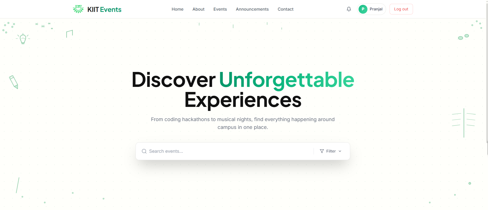
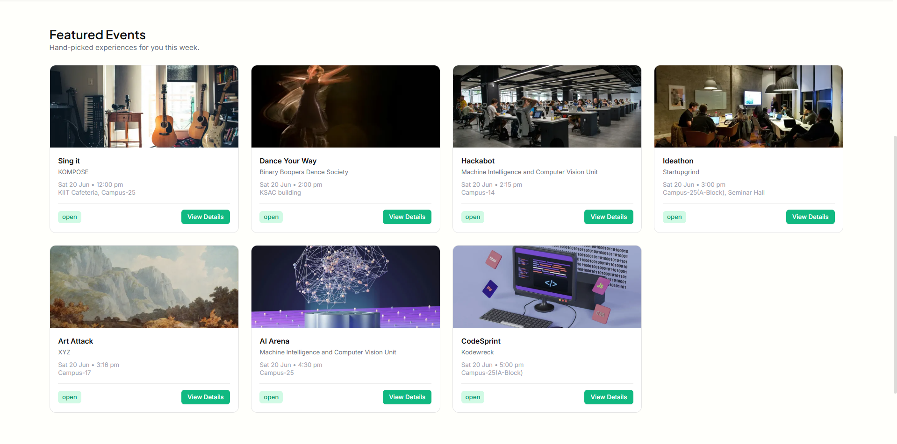
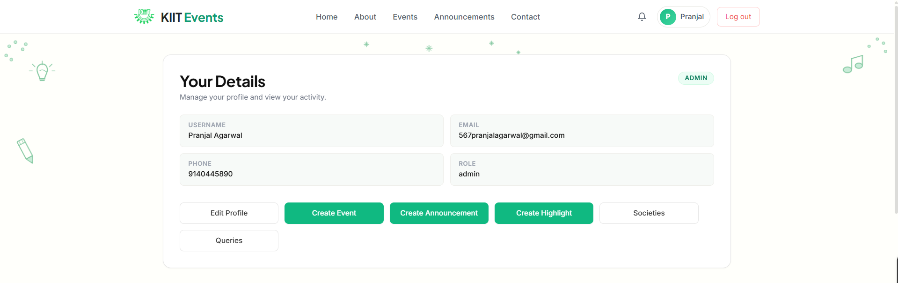
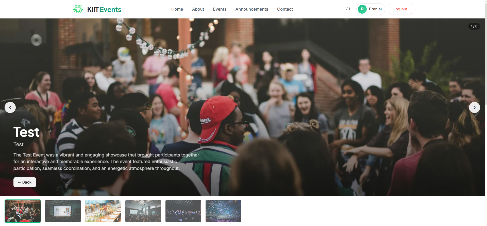

# KIIT Events

A full-stack event discovery and management platform built for university students and societies. Students can browse upcoming events, RSVP, and follow society announcements; society organizers and admins manage events, posters, highlights, and member requests from a dedicated dashboard.

## Live Demo

[View Live](https://kiitevents.netlify.app/)

## Screenshots









## Features

- Browse upcoming and past university events with filtering and search
- One-click RSVP and registration tracking
- Society pages with details, members, and per-society announcements
- Organizer dashboard for creating, editing, and deleting events
- Event highlights to showcase past events with photos
- Poster uploads backed by Cloudinary
- Real-time notifications via Socket.IO (announcements, registration updates)
- Society request workflow — students can apply to form new societies; admins review
- Admin query/support inbox
- Email notifications via Nodemailer (registration confirmations, organizer alerts)
- JWT-based authentication with role-aware UI (student / society organizer / admin)
- Responsive layout down to 320px-wide screens

## Tech Stack

**Frontend**
- React 19 + Vite
- Tailwind CSS
- React Router 7
- Axios, Socket.IO client
- Framer Motion (`motion`), lucide-react / react-icons
- React Toastify

**Backend**
- Node.js + Express
- MongoDB with Mongoose
- Socket.IO
- JWT + bcrypt for authentication
- Multer + Cloudinary for image uploads
- Nodemailer for transactional email

## Project Structure

```
.
├── src/                  # React frontend (Vite)
│   ├── Components/
│   ├── pages/
│   ├── context/
│   └── utils/
├── server/               # Express API
│   ├── routes/
│   ├── models/
│   ├── middleware/
│   └── index.js
└── Screenshots/
```

## Getting Started

### Prerequisites

- Node.js 18+
- A MongoDB connection string (Atlas or local)
- A Cloudinary account (for poster / highlight uploads)
- An SMTP-capable email account for Nodemailer (e.g. Gmail app password)

### 1. Clone

```bash
git clone https://github.com/55Pranjal/kiit-events.git
cd kiit-events
```

### 2. Frontend setup

```bash
npm install
```

Create a `.env.local` in the project root:

```
VITE_FRONTEND_URL=http://localhost:5173
VITE_BACKEND_URL=http://localhost:5000
VITE_API_URL=http://localhost:5000
```

Run the dev server:

```bash
npm run dev
```

### 3. Backend setup

```bash
cd server
npm install
```

Create a `server/.env` with at least:

```
PORT=5000
MONGO_URI=<your mongodb connection string>
JWT_SECRET=<a long random string>
CLOUDINARY_CLOUD_NAME=<...>
CLOUDINARY_API_KEY=<...>
CLOUDINARY_API_SECRET=<...>
EMAIL_USER=<smtp user>
EMAIL_PASS=<smtp password / app password>
```

Start the API:

```bash
npm start
```

The frontend expects the backend at `http://localhost:5000` by default; update `VITE_BACKEND_URL` / `VITE_API_URL` if you change the port.

## Scripts

Frontend (root):

| Command | Description |
| --- | --- |
| `npm run dev` | Start Vite dev server |
| `npm run build` | Production build to `dist/` |
| `npm run preview` | Preview the production build |
| `npm run lint` | Run ESLint |

Backend (`server/`):

| Command | Description |
| --- | --- |
| `npm start` | Start the Express + Socket.IO server |

## Deployment

- **Frontend** is deployed on Netlify (see live demo).
- **Backend** can be deployed to any Node-friendly host (Render, Railway, Fly.io, etc.). Make sure to set the same env vars as `server/.env` and add the deployed frontend URL to the CORS allow-list in `server/index.js`.

## Future Improvements

- Calendar export / Google Calendar integration
- Push reminders ahead of events
- Advanced filtering (by society, date range, tags)
- Saved / favorited events
- Improved analytics for organizers
